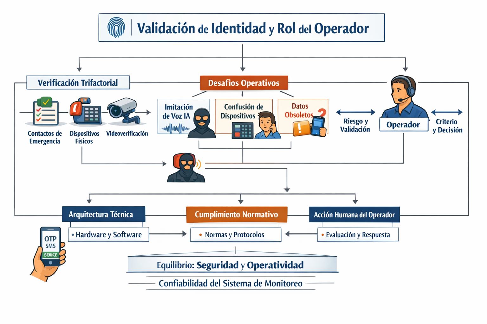
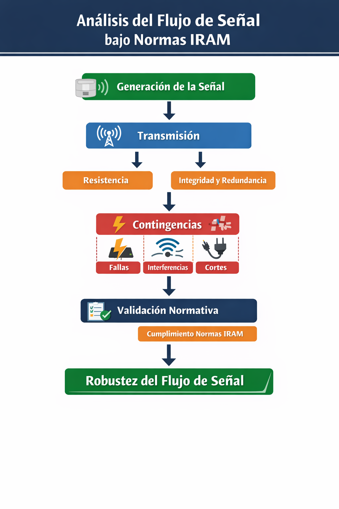
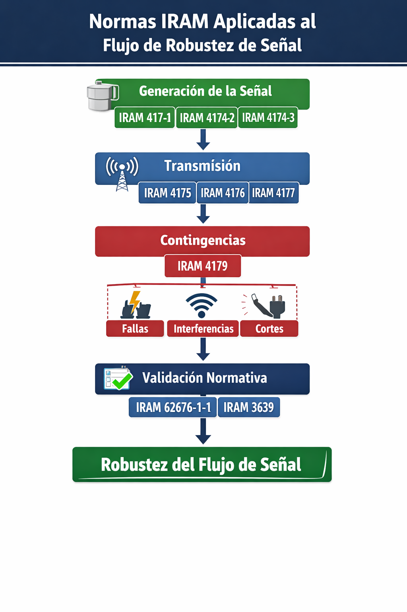

# Esquema del ensayo

1.Introducción

- Contexto: sistemas de monitoreo en operación real.

    - Validación de Identidad y Rol del Operador

- Propósito: analizar la robustez del flujo de señal bajo Normas IRAM.

- Alcance: ensayo técnico, no TFI formal, pero con rigor académico.

2. Generación de la señal

- Cómo se origina la información en el panel.

- Tipos de sensores y confiabilidad inicial.

- Riesgos en la etapa de captura.

3. Procesamiento de la señal

- Transmisión y transformación de datos.

- Puntos críticos: pérdida, alteración, latencia.

- Rol de la ciberseguridad como garante de integridad (no como fin).

4. Decisión del operador

- Validación de la información en tiempo real.

- Factores humanos y tecnológicos.

- Impacto de errores en la eficacia del servicio.

4. Normas IRAM como marco

- Principios de confiabilidad y calidad de datos.

- Cómo se aplican al flujo completo (Generación → Procesamiento → Decisión).

- Ejemplos de buenas prácticas.

### Conclusiones

- Síntesis de hallazgos.

- Valor del enfoque sistémico.

- Proyección hacia un futuro TFI o tesina.

# Introduccion 

En el ecosistema actual de la seguridad electrónica, el rol del operador de monitoreo ha trascendido la mera observación pasiva para convertirse en el eje crítico de un sistema complejo de gestión de datos. El presente ensayo se propone analizar la robustez de este proceso, tomando como vector principal el cumplimiento de las normas IRAM 4174-1 y 2, las cuales establecen los estándares de disponibilidad e integridad necesarios para una respuesta eficiente ante incidentes. Sin embargo, en un entorno donde la convergencia digital es absoluta, la integridad de la señal —entendida como la garantía de que el dato generado en el objetivo llega al operador sin alteraciones ni latencias críticas— se vuelve el desafío técnico primordial. Al cruzar los fundamentos del Análisis de Sistemas con los protocolos de seguridad lógica, buscaremos identificar cómo la arquitectura del sistema influye directamente en la toma de decisiones del operador, transformando la tecnología de una simple herramienta en un garante de la seguridad pública y privada.

Este ensayo sostiene que la confiabilidad del dato en sistemas de monitoreo depende tanto de la arquitectura técnica como del cumplimiento normativo, y que el operador es el punto crítico donde esa confiabilidad se valida en tiempo real

# Contexto: sistemas de monitoreo en operación real.

En el ecosistema actual de la seguridad electrónica, el rol del operador de monitoreo ha trascendido la mera observación pasiva para convertirse en el eje crítico de un sistema complejo de gestión de datos. El presente ensayo sostiene que la confiabilidad del dato en sistemas de monitoreo depende tanto de la arquitectura técnica como del cumplimiento normativo, y que el operador es el punto donde esa confiabilidad se valida en tiempo real. Esta afirmación se refleja en la práctica cotidiana de centros de monitoreo como XXXXXX, donde cada contingencia —desde un corte de luz hasta la caída de un proveedor de Internet— exige protocolos precisos y decisiones inmediatas para garantizar la continuidad del servicio. “Todo evento requiere un hacer algo”, subrayando que la tecnología por sí sola no basta: es la interacción entre infraestructura, normas (como las IRAM 4174-1 y 2) y acción humana la que asegura que la señal generada en el objetivo llegue íntegra al operador. En este entorno de convergencia digital absoluta, la arquitectura del sistema y el cumplimiento normativo se convierten en pilares que transforman la tecnología de una simple herramienta en un garante de la seguridad pública y privada.

En la operación diaria de un centro de monitoreo, la confiabilidad del dato se pone a prueba frente a contingencias técnicas y normativas que requieren protocolos precisos y decisiones inmediatas. En este entorno, la arquitectura del sistema y el cumplimiento de estándares como las Normas IRAM se convierten en pilares para garantizar que el operador pueda validar la integridad de la señal en tiempo real.

- Validación de Identidad y Rol del Operador
En los sistemas de monitoreo, la confiabilidad del dato no termina en la arquitectura técnica ni en el cumplimiento normativo: se valida en tiempo real a través de la interacción entre el operador y el abonado. Un ejemplo concreto es el protocolo de blanqueo de palabras clave desarrollado en XXXXXX, que introduce una validación trifactorial basada en preguntas de seguridad (contactos de emergencia, dispositivos físicos y servicios de videoverificación). Este procedimiento busca garantizar que solo personas autorizadas puedan modificar credenciales críticas.

Sin embargo, la práctica revela tensiones entre la seguridad lógica y la operatividad real. En la conversación con xxxx Costa, se señalaron riesgos como la posible imitación de voz mediante inteligencia artificial, la confusión de clientes respecto a dispositivos (botón de pánico vs teclado, DVR vs videoverificación), y la dificultad de recordar contactos de emergencia registrados años atrás. Estos factores muestran que, aunque el protocolo es normativamente sólido, su aplicación puede generar fricciones y demoras en la Sala de Operaciones.

El operador, en este contexto, se convierte en el validador final de la confiabilidad del dato. Su criterio es indispensable para interpretar respuestas ambiguas, decidir si una validación es aceptable y mantener la continuidad operativa sin comprometer la seguridad. Propuestas como incluir verificaciones OTP por SMS, preguntas de rescate administrativas o autorizaciones masivas del titular reflejan la necesidad de equilibrar rigor normativo con flexibilidad operativa.

Este caso práctico evidencia que la confiabilidad del sistema depende de tres pilares inseparables:

Arquitectura técnica (paneles, receptores, software).

Cumplimiento normativo (protocolos, normas IRAM, procedimientos internos).

Acción humana del operador, que valida y contextualiza la información en tiempo real.

En definitiva, la validación de identidad no es solo un proceso administrativo, sino un punto crítico donde se define la eficacia del sistema de monitoreo y la confianza del abonado en el servicio.

# Propósito: Analizar la robustez del flujo de señal bajo Normas IRAM
El objetivo de este capítulo es evaluar la robustez del flujo de señal en sistemas de monitoreo, tomando como referencia las Normas IRAM 4174-1, 4174-2, 4174-3, 4175, 4176, 4177, 4179, 62676-1-1 y 3639. Estas normas establecen criterios de disponibilidad, integridad y confiabilidad que permiten garantizar que la señal generada en el punto de origen (sensor, panel o dispositivo) llegue al centro de monitoreo sin alteraciones ni pérdidas críticas.

La robustez del flujo de señal se entiende como la capacidad del sistema para:

Resistir contingencias (cortes de energía, fallas de ISP, interferencias).

Mantener integridad en la transmisión (evitar corrupción de datos o falsos positivos).

Asegurar redundancia mediante canales alternativos y protocolos de respaldo.

Cumplir normativamente con los estándares IRAM, que definen parámetros mínimos de calidad y seguridad.

Este análisis busca demostrar que la confiabilidad del dato no depende únicamente de la tecnología instalada, sino de la convergencia entre arquitectura técnica, cumplimiento normativo y operación humana. El flujo de señal es el hilo conductor que une todos los componentes del sistema, y su robustez es el factor decisivo para que el monitoreo sea eficaz y confiable.

Qué muestra este esquema

- Generación de la señal → sensores y paneles como origen.

- Transmisión → antenas, canales de comunicación.

- Resistencia / Integridad / Redundancia → capacidad de soportar fallas y mantener datos intactos.

- Contingencias → cortes de energía, fallas de ISP, interferencias.

- Validación normativa → cumplimiento de Normas IRAM como garantía de calidad.

- Resultado final → Robustez del flujo de señal.

**Figura 3. Normas IRAM aplicadas al flujo de robustez de señal**

El presente esquema visualiza la correspondencia entre las etapas del flujo de señal y las Normas IRAM que regulan su robustez técnica y operativa.  
Cada norma actúa como un eslabón dentro de la cadena de confiabilidad:

- **IRAM 4174-1 / 4174-2 / 4174-3** → establecen los requisitos de diseño, instalación y mantenimiento de sistemas de alarma, garantizando la correcta generación de la señal.  
- **IRAM 4175 / 4176 / 4177** → definen los protocolos de comunicación, redundancia de canales y continuidad del servicio, asegurando la integridad durante la transmisión.  
- **IRAM 4179** → regula la respuesta ante contingencias críticas (fallas eléctricas, interferencias, cortes de enlace), preservando la disponibilidad del sistema.  
- **IRAM 62676-1-1 / 3639** → norman la interoperabilidad de sistemas de videoverificación y los requisitos eléctricos y de compatibilidad, consolidando la validación normativa final.

La **robustez del flujo de señal** se alcanza cuando cada etapa cumple simultáneamente con los estándares técnicos y regulatorios definidos por estas normas, permitiendo que la información llegue íntegra y verificable al centro de monitoreo incluso bajo condiciones adversas.

---

## Arquitectura técnica del sistema

La arquitectura técnica del sistema de monitoreo se compone de **elementos físicos y lógicos** que interactúan para garantizar la robustez del flujo de señal y la confiabilidad del dato.  
Cada componente cumple una función específica dentro del marco normativo IRAM, asegurando trazabilidad, redundancia y validación operativa.

###  Componentes físicos
- **Sensores y paneles** → puntos de origen de la señal, regulados por IRAM 4174‑1/2/3.  
- **Medios de transmisión** → cableado, radioenlace, IP, GSM; sujetos a IRAM 4175‑4177.  
- **Fuentes de energía y respaldo** → UPS, baterías, generadores; contemplados en IRAM 4179.  
- **Equipos de videoverificación** → cámaras y grabadores conforme a IRAM 62676‑1‑1.  

###  Componentes lógicos
- **Software de monitoreo** → gestiona eventos, alarmas y redundancia de canales.  
- **Protocolos de comunicación** → TCP/IP, MQTT, redundancia dual; alineados con IRAM 4176.  
- **Validación normativa** → cumplimiento de IRAM 3639 para compatibilidad eléctrica y seguridad.  
- **Operador humano** → último eslabón de validación, responsable de confirmar la integridad del dato.

### 🔄 Interacción sistémica
El flujo de señal se origina en el sensor, atraviesa los medios físicos y lógicos, y llega al centro de monitoreo donde se valida normativamente.  
La **robustez** se logra cuando cada capa cumple su función bajo los estándares IRAM, permitiendo continuidad operativa incluso ante contingencias.

---

**Nota:** Esta figura sintetiza la convergencia entre infraestructura física, lógica y normativa, mostrando cómo la arquitectura técnica sostiene la confiabilidad del sistema de monitoreo.

